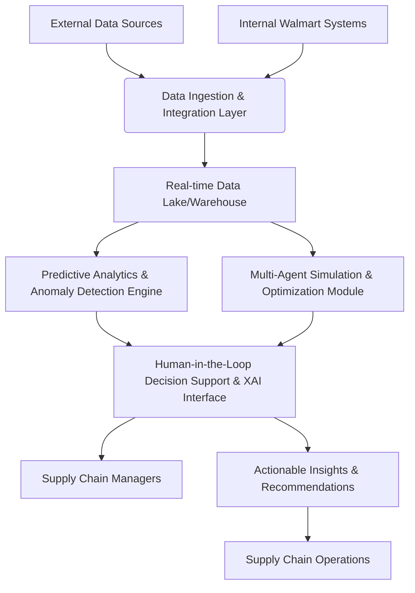

# ResilienceNet: System Architecture and Technical Specifications

## 1. Introduction

This document outlines the system architecture and technical specifications for ResilienceNet, an AI-powered platform designed to enhance Walmart India's supply chain resilience. The platform aims to transform reactive crisis management into proactive, automated resilience by leveraging real-time data, advanced predictive analytics, multi-agent simulations, and an intuitive human-in-the-loop interface. This solution addresses the critical 'decision-making gap' identified in Walmart India's current supply chain operations, which leads to significant financial losses and operational inefficiencies during unforeseen disruptions.

## 2. High-Level Architecture Overview

ResilienceNet is conceptualized as a modular, scalable, and extensible platform. It comprises several interconnected components, each responsible for a specific set of functionalities, working in concert to provide end-to-end disruption prediction, analysis, and mitigation capabilities. The high-level architecture is depicted below:

**Components:**

*   **External Data Sources:** Feeds from global news, weather, maritime tracking, geopolitical intelligence, and third-party supplier risk platforms.
*   **Internal Walmart Systems:** Existing data from Walmart's Element AI, Luminate, Transportation Management Systems (TMS), Warehouse Management Systems (WMS), RFID, and IoT sensors.
*   **Data Ingestion & Integration Layer:** Responsible for collecting, cleaning, transforming, and unifying data from diverse sources in real-time.
*   **Real-time Data Lake/Warehouse:** A centralized, scalable repository for all ingested data, optimized for both batch processing and real-time analytics.
*   **Predictive Analytics & Anomaly Detection Engine:** Utilizes advanced AI/ML models to identify early warning signs of potential disruptions and predict their direct and cascading effects.
*   **Multi-Agent Simulation & Optimization Module:** Employs a multi-agent system and a digital twin of the supply chain to simulate various disruption scenarios and evaluate optimal mitigation strategies.
*   **Human-in-the-Loop Decision Support & XAI Interface:** Provides an interactive dashboard for supply chain managers, offering actionable insights, explainable AI (XAI) rationales, and tools for rapid decision-making.
*   **Supply Chain Managers:** The end-users who interact with the system to gain insights and execute mitigation strategies.
*   **Actionable Insights & Recommendations:** The output of the system, providing clear, prioritized recommendations for mitigating disruptions.
*   **Supply Chain Operations:** The physical and logistical processes within Walmart India's supply chain that are influenced by the system's recommendations.

## 3. Detailed Component Breakdown

### 3.1. Data Ingestion & Integration Layer

**Purpose:** To establish a robust, real-time data pipeline that aggregates and normalizes information from a multitude of internal and external sources. This layer is crucial for providing the foundational data required for all subsequent analytical and predictive processes. The goal is to achieve comprehensive, real-time visibility across the entire supply chain, enabling the system to detect anomalies and potential disruptions as they emerge.

**Key Responsibilities:**

*   **Data Collection:** Ingesting data from various APIs, databases, streaming platforms, and file systems.
*   **Data Transformation:** Cleaning, normalizing, and enriching raw data to ensure consistency and usability across the platform.
*   **Real-time Processing:** Handling high-velocity data streams with low latency to support immediate anomaly detection and predictive modeling.
*   **Schema Management:** Adapting to evolving data schemas from diverse sources and ensuring data compatibility.
*   **Error Handling & Monitoring:** Implementing robust mechanisms for identifying and resolving data ingestion failures and monitoring data quality.

**Data Sources (Examples):**

*   **Internal Walmart Data:**
    *   **Element AI/Luminate:** Demand forecasts, inventory levels, sales data, customer behavior insights.
    *   **Transportation Management Systems (TMS):** Shipment tracking, carrier performance, route optimization data.
    *   **Warehouse Management Systems (WMS):** Inventory movements, warehouse capacity, labor utilization.
    *   **RFID Data:** Real-time product location and movement within stores and distribution centers.
    *   **IoT Sensors:** Temperature, humidity, location data from cold chain logistics, fleet telematics, warehouse equipment status.
    *   **Supplier Performance Databases:** Historical performance, lead times, quality metrics, compliance data.
*   **External Data Sources:**
    *   **Global News Feeds (e.g., Reuters, Bloomberg, specialized geopolitical intelligence services):** Real-time alerts on political instability, trade policy changes, conflicts, and economic shifts that could impact global supply chains.
    *   **Weather APIs (e.g., NOAA, AccuWeather, OpenWeatherMap):** Predictive weather patterns, severe weather warnings (hurricanes, floods, blizzards) that could disrupt transportation routes or operations.
    *   **Maritime Tracking Data (e.g., MarineTraffic, VesselFinder):** Real-time positions and status of cargo ships, port congestion, shipping lane disruptions (e.g., Suez Canal, Panama Canal, Red Sea incidents).
    *   **Air Traffic Data (e.g., FlightAware APIs):** Real-time flight status, airport delays, air cargo capacity.
    *   **Road Traffic Data (e.g., Google Maps API, HERE Technologies):** Real-time traffic conditions, road closures, congestion impacting ground transportation.
    *   **Supplier Risk Assessment Platforms (e.g., Interos.ai, Everstream Analytics):** Third-party insights into supplier financial health, geopolitical exposure, labor practices, and environmental risks.
    *   **Economic Indicators & Market Indices:** Commodity prices, currency exchange rates, inflation data that can impact supply chain costs.
    *   **Social Media & Public Sentiment Analysis:** Early indicators of local unrest, consumer panic buying, or emerging regional issues that might affect demand or supply.

**Technical Stack:**

*   **Data Streaming/Messaging Queues:**
    *   **Apache Kafka:** A distributed streaming platform capable of handling high-throughput, fault-tolerant data feeds. Ideal for real-time ingestion of diverse data streams.
    *   **Azure Event Hubs / Google Cloud Pub/Sub:** Managed alternatives to Kafka, offering similar capabilities for cloud-native deployments.
*   **ETL/ELT Tools:**
    *   **Apache Flink / Apache Spark Streaming:** For real-time data processing, transformation, and aggregation before storage.
    *   **NiFi:** For automated data flow management, especially useful for connecting disparate systems and handling complex data routing.
*   **API Gateways:**
    *   **Kong / Apigee:** To manage and secure API integrations with external data providers and internal systems.
*   **Programming Languages/Frameworks:**
    *   **Python:** For custom data connectors, data cleaning scripts, and integration logic (using libraries like `requests`, `pandas`, `pykafka`, `azure-eventhub`).
    *   **Java/Scala:** For high-performance streaming applications with Spark or Flink.

### 3.2. Real-time Data Lake/Warehouse

**Purpose:** To serve as the central, scalable, and highly available repository for all raw and processed supply chain data. This component is designed to support both real-time analytical queries for the predictive engine and historical data analysis for model training and auditing.

**Key Responsibilities:**

*   **Scalable Storage:** Accommodating petabytes of structured, semi-structured, and unstructured data.
*   **Data Governance:** Ensuring data quality, security, compliance, and access control.
*   **Data Cataloging:** Maintaining metadata for all data assets to facilitate discovery and understanding.
*   **Optimized for Analytics:** Providing fast query performance for various analytical workloads, from real-time dashboards to complex ML model training.
*   **Data Versioning & Lineage:** Tracking changes to data over time and understanding its origin and transformations.

**Technical Stack:**

*   **Cloud Storage:**
    *   **Azure Data Lake Storage Gen2 / Amazon S3 / Google Cloud Storage:** Cost-effective, highly scalable, and durable object storage for raw and processed data.
*   **Data Warehousing/Lakehouse:**
    *   **Databricks Lakehouse Platform:** Combines the flexibility of a data lake with the performance and management features of a data warehouse. Ideal for supporting both streaming and batch analytics, and directly integrates with Spark for ML workloads.
    *   **Snowflake:** A cloud-native data warehouse known for its scalability, performance, and separation of compute and storage.
    *   **Azure Synapse Analytics / Google BigQuery:** Fully managed, highly scalable data warehousing solutions with integrated analytics capabilities.
*   **Database Technologies (for specific operational data stores or metadata):**
    *   **PostgreSQL / MySQL:** For relational data that requires ACID compliance.
    *   **MongoDB / Cassandra:** For NoSQL data, especially high-volume, semi-structured data.
*   **Data Catalog/Metadata Management:**
    *   **Apache Atlas / Collibra:** For managing data lineage, metadata, and data governance policies.

### 3.3. Predictive Analytics & Anomaly Detection Engine

**Purpose:** To proactively identify potential supply chain disruptions, predict their direct and cascading impacts, and flag anomalies that indicate emerging risks. This engine is the brain of ResilienceNet, transforming raw data into actionable intelligence.

**Key Responsibilities:**

*   **Early Warning System:** Detecting subtle shifts or unusual patterns in data that precede major disruptions.
*   **Impact Prediction:** Forecasting the immediate and downstream effects of a disruption on inventory, lead times, costs, and customer service levels.
*   **Root Cause Analysis:** Identifying the underlying causes of detected anomalies and predicted impacts.
*   **Model Management:** Training, evaluating, deploying, and monitoring a suite of machine learning models.
*   **Continuous Learning:** Adapting models to new data patterns and evolving supply chain dynamics.

**Models & Algorithms:**

*   **Time-Series Forecasting:**
    *   **Long Short-Term Memory (LSTM) Networks:** Deep learning models particularly effective for capturing complex temporal dependencies in sequential data (e.g., demand fluctuations, lead time variations).
    *   **Prophet (Facebook):** A robust forecasting procedure for univariate time series data, especially useful for data with strong seasonal effects and multiple historical observations.
    *   **ARIMA/SARIMA:** Traditional statistical models for time series forecasting, suitable for data with clear trends and seasonality.
*   **Anomaly Detection:**
    *   **Isolation Forest:** An ensemble tree-based model that effectively isolates anomalies by building random trees and measuring path lengths.
    *   **Autoencoders (Neural Networks):** Unsupervised learning models that learn a compressed representation of normal data; deviations from this representation indicate anomalies.
    *   **Bayesian Changepoint Detection:** Statistical methods for identifying abrupt changes in data streams, useful for detecting sudden shifts in supply chain metrics.
    *   **One-Class SVM:** A support vector machine variant used for anomaly detection when only normal data is available for training.
*   **Graph Neural Networks (GNNs) for Cascading Failure Prediction:**
    *   **Concept:** The supply chain is inherently a complex network (graph) where nodes represent entities (suppliers, factories, distribution centers, stores, ports, transportation hubs) and edges represent relationships (supply routes, product flows, dependencies). GNNs are uniquely suited to model these interdependencies and predict how a disruption at one node propagates through the network.
    *   **Specific GNN Architectures:**
        *   **Graph Convolutional Networks (GCNs):** Learn features by aggregating information from neighboring nodes.
        *   **Graph Attention Networks (GATs):** Assign different weights to neighbors, allowing the model to focus on more relevant connections.
        *   **Temporal Graph Networks (TGNs):** Extend GNNs to handle dynamic graphs, where relationships and node features change over time, crucial for a real-time supply chain.
    *   **Application:** If a port (node) is closed, the GNN can predict which specific products, distribution centers, and ultimately stores (other nodes) will be affected, and with what severity and timeline, by analyzing the flow paths and dependencies.
*   **Predictive Maintenance (for assets like trucks, warehouse machinery):**
    *   **Random Forests / Gradient Boosting Machines:** For predicting equipment failures based on IoT sensor data (vibration, temperature, pressure, usage hours).
    *   **Survival Analysis Models:** To estimate the remaining useful life of assets.

**Technical Stack:**

*   **ML Platform:**
    *   **Walmart's Element AI Platform:** Leveraging existing internal infrastructure for model development, training, and deployment. This ensures compatibility and integration with current Walmart systems.
    *   **Azure Machine Learning / Google Cloud AI Platform / AWS SageMaker:** Managed cloud ML platforms offering end-to-end MLOps capabilities (experiment tracking, model registry, deployment endpoints, monitoring).
*   **Programming Languages/Libraries:**
    *   **Python:** The primary language for ML development.
    *   **TensorFlow / PyTorch:** For building and training deep learning models (LSTMs, Autoencoders, GNNs).
    *   **Scikit-learn:** For traditional ML algorithms (Isolation Forest, One-Class SVM, Random Forests).
    *   **NetworkX / PyG (PyTorch Geometric) / DGL (Deep Graph Library):** For building and analyzing graph structures and implementing GNNs.
    *   **Pandas / NumPy:** For data manipulation and numerical operations.

### 3.4. Multi-Agent Simulation & Optimization Module

**Purpose:** To simulate various disruption scenarios within a digital twin of the supply chain and identify optimal, pre-vetted mitigation strategies. This module moves beyond prediction to prescriptive analytics, recommending the best course of action.

**Key Responsibilities:**

*   **Digital Twin Creation:** Maintaining a dynamic, data-fed digital replica of Walmart India's supply chain network, including all relevant entities (suppliers, DCs, stores, transportation routes, inventory levels, demand patterns).
*   **Scenario Simulation:** Running 

"what-if" simulations to model the impact of different disruptions (e.g., port closures, supplier failures, demand surges).
*   **Multi-Agent System (MAS):** Employing a system of intelligent, autonomous agents that represent different supply chain entities. These agents interact, negotiate, and collaborate to find optimal solutions to disruptions.
*   **Optimization:** Using a combination of reinforcement learning, heuristic algorithms, and mathematical optimization to identify the best mitigation strategies (e.g., re-routing, alternative sourcing, inventory reallocation).
*   **Strategy Generation:** Creating a playbook of pre-vetted, ranked mitigation strategies for various disruption scenarios.

**Multi-Agent System (MAS) Design:**

*   **Concept:** Instead of a single, monolithic AI, the MAS consists of multiple, specialized agents that work together. This decentralized approach is more robust, scalable, and adaptable to complex, dynamic environments.
*   **Agent Types:**
    *   **Monitoring Agents:** Continuously scan data streams for anomalies and disruption signals. When a potential disruption is identified, they trigger the appropriate Impact Assessment Agents.
    *   **Impact Assessment Agents:** Each agent is responsible for a specific domain (e.g., a product category like "High-Margin Electronics," a geographical region, or a specific logistics hub). When triggered, they analyze the potential impact of the disruption on their domain, considering factors like inventory levels, demand forecasts, and lead times.
    *   **Mitigation Agents:** These agents are responsible for generating and evaluating potential mitigation actions. For example:
        *   **Re-routing Agent:** Proposes alternative transportation routes, considering cost, speed, and risk.
        *   **Alternative Sourcing Agent:** Identifies and evaluates alternative suppliers for affected products.
        *   **Inventory Reallocation Agent:** Suggests moving inventory between distribution centers or stores to meet demand.
        *   **Expedited Shipping Agent:** Evaluates the cost-benefit of using faster shipping methods (e.g., air freight).
    *   **Coordination Agents:** These agents act as facilitators, enabling communication and negotiation between different Mitigation Agents. They aim to find a globally optimal solution that balances competing objectives (e.g., minimizing cost vs. maximizing product availability). They use mechanisms like contract net protocols or auctions to allocate resources and tasks.

**Simulation & Optimization Techniques:**

*   **Digital Twin:** A dynamic, data-driven simulation model of the entire supply chain. It is continuously updated with real-time data and serves as the environment for the multi-agent system.
*   **Reinforcement Learning (RL):** Agents can be trained using RL to learn optimal policies over time. By interacting with the digital twin and receiving rewards or penalties based on their actions, they can adapt to novel disruption scenarios and discover effective mitigation strategies that might not be obvious to human operators.
*   **Heuristic Optimization:** For rapid decision-making, pre-computed optimal strategies for common disruption patterns can be stored in a "scenario playbook." When a known disruption occurs, the system can quickly retrieve and recommend the best pre-vetted response.
*   **Mathematical Optimization:** For complex problems with well-defined constraints (e.g., vehicle routing, inventory allocation), mathematical optimization solvers can be used to find provably optimal solutions.

**Technical Stack:**

*   **Simulation Frameworks:**
    *   **AnyLogic / Simio:** Commercial simulation software that provides powerful tools for building detailed digital twins and agent-based models.
    *   **Mesa (Python):** An open-source agent-based modeling framework in Python, suitable for building custom simulations.
    *   **Custom Python/Java Simulation:** For highly tailored simulation environments.
*   **Reinforcement Learning Libraries:**
    *   **Ray RLlib:** A scalable, open-source RL library that supports a wide range of algorithms and integrates well with other frameworks.
    *   **Stable Baselines3:** A set of reliable implementations of RL algorithms in PyTorch.
*   **Optimization Solvers:**
    *   **Google OR-Tools:** An open-source software suite for combinatorial optimization.
    *   **Gurobi / CPLEX:** Commercial optimization solvers for high-performance mathematical programming.

### 3.5. Human-in-the-Loop Decision Support & XAI Interface

**Purpose:** To bridge the gap between advanced AI and human decision-makers. This component provides an intuitive, interactive interface that presents complex information in a clear and actionable format, fostering trust and enabling rapid, confident decision-making.

**Key Responsibilities:**

*   **Data Visualization:** Presenting real-time supply chain data, detected anomalies, and predicted impacts through interactive maps, charts, and graphs.
*   **Actionable Recommendations:** Displaying the ranked mitigation strategies generated by the optimization module, along with their expected outcomes and trade-offs.
*   **Explainable AI (XAI):** Providing clear, human-understandable explanations for why the AI made a particular prediction or recommendation. This is crucial for building trust and allowing managers to validate the system's outputs.
*   **Scenario Playbook:** Offering a library of pre-vetted response plans for various disruption types, which can be quickly reviewed and executed.
*   **Feedback Loop:** Allowing human operators to provide feedback on the AI's recommendations, which is used to continuously retrain and improve the models.
*   **Alerting & Notification:** Sending timely alerts to relevant stakeholders when critical disruptions are detected or when human intervention is required.

**Features:**

*   **Interactive Dashboard:** A centralized view of the entire supply chain, with drill-down capabilities to explore specific regions, products, or disruptions.
*   **What-If Analysis Tools:** Allowing managers to manually adjust parameters and run their own simulations to explore different scenarios.
*   **Collaboration Tools:** Enabling multiple stakeholders to view the same information, communicate, and coordinate their response efforts.
*   **Audit Trail:** Logging all system predictions, recommendations, and user actions for post-mortem analysis and continuous improvement.

**Explainable AI (XAI) Techniques:**

*   **SHAP (SHapley Additive exPlanations):** A game theory-based approach to explain the output of any machine learning model. It can show which features contributed most to a particular prediction (e.g., "the high probability of a stockout is due to the supplier's low performance score and the current port congestion").
*   **LIME (Local Interpretable Model-agnostic Explanations):** Explains the predictions of any classifier or regressor by approximating it locally with an interpretable model.
*   **Rule-Based Explanations:** For simpler models, the system can generate human-readable rules that explain its decisions (e.g., "IF port congestion > 80% AND supplier is single-source THEN recommend alternative sourcing").

**Technical Stack:**

*   **Frontend Frameworks:**
    *   **React.js / Angular / Vue.js:** For building modern, responsive, and interactive single-page applications.
    *   **Streamlit / Dash (Python):** For rapid prototyping of data-centric dashboards and web applications.
*   **Backend APIs:**
    *   **Python (Flask / Django / FastAPI):** For creating RESTful APIs to serve data, AI insights, and simulation results to the frontend.
*   **Data Visualization Libraries:**
    *   **D3.js / Chart.js / Plotly:** For creating rich, interactive charts and graphs.
    *   **Mapbox / Leaflet.js:** For displaying geospatial data and building interactive maps.
*   **XAI Libraries:**
    *   **SHAP / LIME:** For generating model explanations.
*   **Notification Services:**
    *   **Twilio / SendGrid:** For sending SMS and email alerts.

## 4. System Deployment & Scalability

**Deployment Strategy:**

ResilienceNet will be deployed on a cloud platform (e.g., Microsoft Azure, Google Cloud Platform, or AWS) to leverage the scalability, reliability, and managed services they offer. The application will be containerized using Docker and orchestrated with Kubernetes to ensure portability, scalability, and high availability.

A phased rollout approach will be adopted:

1.  **Phase 1: Pilot Program:** The initial deployment will focus on a specific product category (e.g., high-margin electronics) and a limited geographical region. This will allow for testing and refinement of the system in a controlled environment.
2.  **Phase 2: Regional Expansion:** Based on the success of the pilot, the system will be rolled out to other regions within India.
3.  **Phase 3: Full-Scale Deployment:** The platform will be deployed across Walmart India's entire supply chain network.

**Scalability Considerations:**

*   **Horizontal Scaling:** The microservices-based architecture and use of Kubernetes will allow for individual components to be scaled independently based on load.
*   **Data Storage:** Cloud-based data lakes and warehouses are designed for petabyte-scale storage and can be easily scaled as data volumes grow.
*   **Compute Resources:** Cloud platforms provide on-demand access to powerful compute resources (CPUs, GPUs) for training complex ML models and running large-scale simulations.
*   **Load Balancing:** Load balancers will be used to distribute traffic across multiple instances of the application, ensuring high performance and reliability.

## 5. Security & Compliance

**Security Measures:**

*   **Data Encryption:** All data will be encrypted at rest and in transit.
*   **Access Control:** Role-based access control (RBAC) will be implemented to ensure that users can only access the data and functionalities relevant to their roles.
*   **Authentication & Authorization:** Secure authentication mechanisms (e.g., OAuth 2.0, SAML) will be used to verify user identities.
*   **Network Security:** Firewalls, security groups, and virtual private clouds (VPCs) will be used to protect the system from unauthorized access.
*   **Regular Security Audits & Penetration Testing:** The system will undergo regular security assessments to identify and address potential vulnerabilities.

**Compliance:**

The system will be designed to comply with all relevant data privacy and protection regulations, including:

*   **General Data Protection Regulation (GDPR):** If any data from European citizens is processed.
*   **India's Digital Personal Data Protection Act (DPDPA):** To ensure the privacy and security of personal data.
*   **Payment Card Industry Data Security Standard (PCI DSS):** If any payment card data is handled.

## 6. Conclusion

ResilienceNet represents a significant leap forward in supply chain management for Walmart India. By combining real-time data, advanced AI, and a human-in-the-loop approach, the platform will provide the tools and insights needed to move from reactive crisis management to proactive, automated resilience. The modular architecture and phased rollout plan ensure that the system can be developed, deployed, and scaled in a manageable and effective manner, delivering tangible value at each stage of the process. This will not only mitigate financial losses but also enhance customer satisfaction and solidify Walmart India's position as a leader in supply chain innovation.

